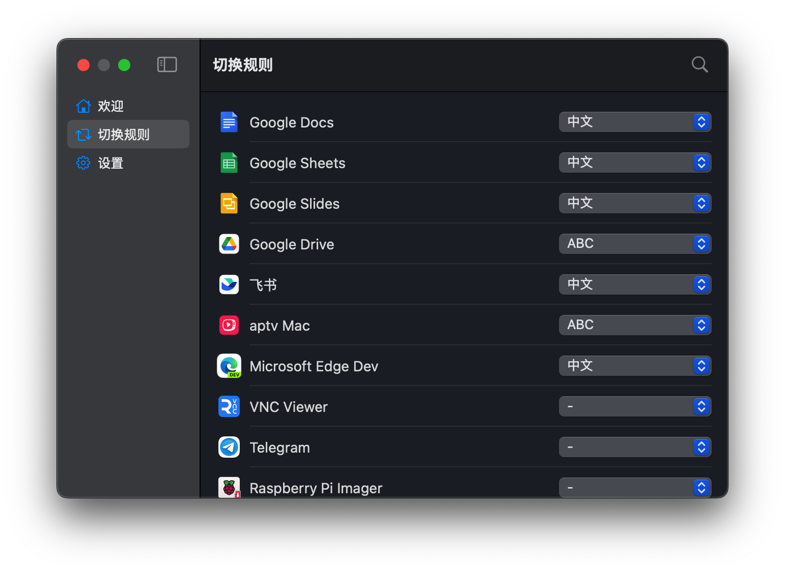

# 输入法自动切换

这是一个 MacOS 小工具，能够根据前台应用程序，自动切换输入法，提供更加高效的输入体验。



> 警告！此程序大量使用AI编程，未广泛测试，有非常多离谱的bug 💦

## 功能介绍

- **自动输入法切换**：根据前台应用，自动切换到指定的输入法。
- **输入法管理**：可以通过应用界面设置不同应用程序的默认输入法。
- **MacOS原生UI**：使用原生 SwiftUI 框架开发，更加贴近系统审美风格。

## 环境要求

- macOS 11.0 或更高版本
- Xcode 12 或更高版本
- Swift 5.3 或更高版本

## 安装和编译步骤

1. **克隆项目**：
   首先，将项目克隆到本地工作目录：

   ```bash
   git clone https://github.com/boybook/input-method-switcher.git
   cd input-method-switcher
   ```

2. **打开项目**：
   使用 Xcode 打开 `.xcodeproj` 文件：

   ```bash
   open input-method-switcher.xcodeproj
   ```

   可能需要手动修改组织和包名等信息

3. **安装依赖**：

   使用了以下依赖：
   - [LaunchAtLogin](https://github.com/sindresorhus/LaunchAtLogin)
   
   需要通过 Swift Package Manager 或 CocoaPods 安装依赖。在 Xcode 中，依赖通常会自动安装，但如果未自动安装，请在终端中运行以下命令（根据项目使用的包管理工具）：

   ```bash
   # Swift Package Manager
   swift package resolve

   # CocoaPods
   pod install
   ```

4. **编译项目**：
   在 Xcode 中，选择项目目标（通常是应用程序名称），然后点击左上角的 “Play” 按钮进行编译和运行项目。

5. **运行项目**：
   编译成功后，应用程序会自动在 macOS 上启动。在菜单栏中，你将看到一个输入法切换器的图标，点击该图标可以打开设置窗口。在设置窗口中，你可以为不同应用程序配置不同的输入法。

## 使用指南

1. **自动启动**：打开应用程序后，你可以在设置中选择“开机自动启动”，这样应用程序每次开机时都会自动运行。
2. **添加应用程序规则**：在应用程序列表中，选择需要为其设置输入法的应用程序，并在右侧的下拉框中选择对应的输入法。
3. **保存设置**：所有的设置都会自动保存，并且当切换到特定的应用程序时，输入法会自动切换为已设定的输入法。

## 问题反馈

如果你在使用过程中遇到任何问题，或者有任何改进建议，欢迎在 [GitHub Issues](https://github.com/boybook/input-method-switcher/issues) 中提出你的问题和建议。

## 许可证

该项目使用 Apache 2.0 许可证，详情请参阅 [LICENSE](LICENSE) 文件。

---

感谢你的使用和支持！
